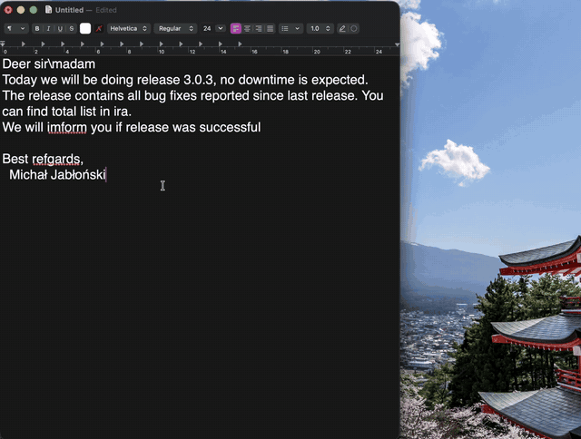
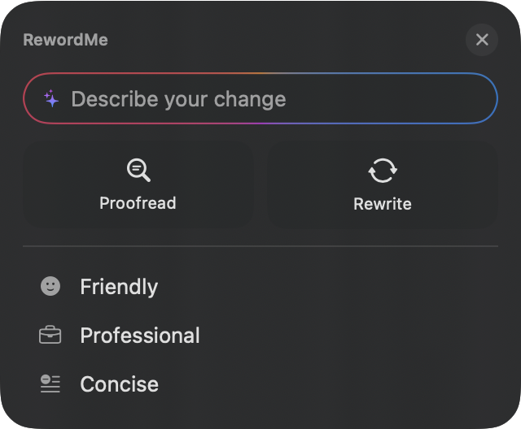
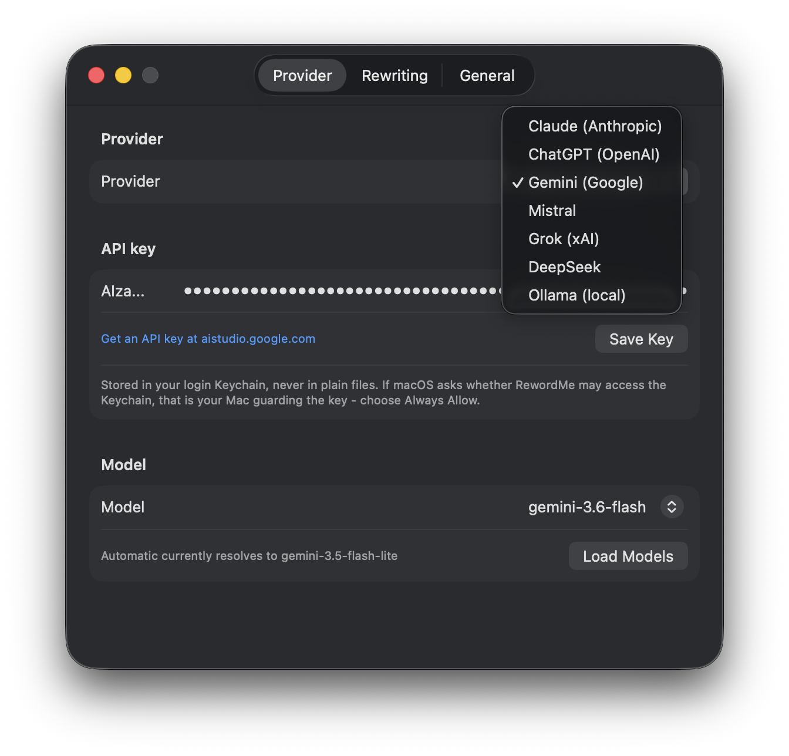
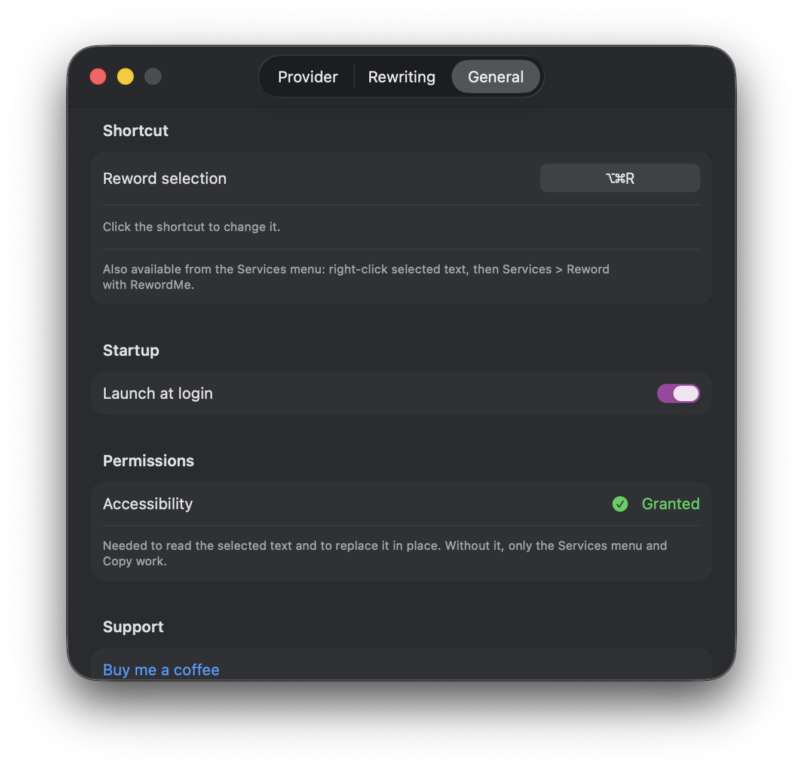
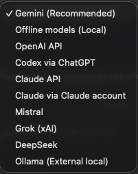
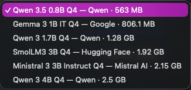

# RewordMe


[](https://buymeacoffee.com/kofcio94f)

A tiny macOS menu-bar app that rewrites your selected text with an LLM. Select text in any app,
press **Option+Command+R**, and a floating popup appears with a reworded version - regenerate it,
steer the next generation ("more formal"), copy it, or replace the selection in place. Bring your
own API key, an existing ChatGPT/Claude subscription through its official installed app, or a
managed local model. Gemini is recommended for the simplest setup; automatic API mode uses the
least costly model your provider offers.

- Repository: https://github.com/mjablonski94/reword-me
- Platform: macOS 14 (Sonoma) and later
- Localized into 11 languages: English, French, Polish, German, Spanish, Portuguese, Italian, Ukrainian, Simplified Chinese, Japanese, Korean
- Language: Swift 6 (SwiftUI + AppKit)

---

## Demo



*A rough release announcement in TextEdit: select, reword with Gemini, steer the tone, Replace -
the rewritten text lands exactly where the selection was. Sped up 3.5x -
[watch the full-quality video](docs/media/demo.mp4) (54 s).*



---

## Table of contents

- [Demo](#demo)
- [Why RewordMe and not the built-in Writing Tools?](#why-rewordme-and-not-the-built-in-writing-tools)
- [Features](#features)
- [How it works](#how-it-works)
- [Install](#install)
- [Permissions](#permissions)
- [Usage](#usage)
- [Configuration](#configuration)
- [Architecture](#architecture)
- [Development](#development)
- [Distribution](#distribution)
- [Troubleshooting](#troubleshooting)
- [Privacy](#privacy)
- [Support](#support)
- [License](#license)

---

## Why RewordMe and not the built-in Writing Tools?

macOS ships Writing Tools with Apple Intelligence, and it is fine for a quick proofread. RewordMe
exists because "fine" stops being enough the moment you care about *which* model rewrites your
words and *how*:

- **You pick the brain.** Writing Tools is one fixed Apple model. RewordMe speaks to Claude,
  ChatGPT, Gemini, Mistral, Grok, DeepSeek - whichever quality tier, writing style or language
  strength you prefer, on your own key. Automatic mode keeps it on the provider's cheapest model,
  so a rewrite costs fractions of a cent; swap to a frontier model for the emails that matter.
- **It knows your style, permanently.** Your do's and don'ts (*"never use exclamation marks"*,
  *"keep my greetings in Polish"*) and your base prompt (*"I am a non-native speaker; fix grammar
  but keep my voice"*) ride along with **every** rewrite. Writing Tools starts from zero every
  time; RewordMe is personalized once and stays that way.
- **You can steer, not just accept.** Type *"make it sound less corporate"*, press Return, judge,
  press Again. Writing Tools gives you a handful of fixed buttons; RewordMe gives you those *and*
  an open instruction line.
- **Fully local when you want it.** Download an offline model inside Settings—RewordMe supplies
  the runtime, verifies every model, and needs no Ollama—or keep using an existing Ollama server.
  Offline rewrites are free and never leave your machine. Ollama stays on-device when its
  configured server address points to this Mac; a remote address sends text to that host.
- **It runs everywhere.** Any Mac on macOS 14+, Intel included - no Apple-Intelligence-capable
  hardware required. And when an app hides its text from the system (Electron apps, web content),
  RewordMe falls back to a clipboard dance and still works.
- **It fits your hands.** Editable global shortcut, Services-menu entry that needs zero
  permissions, 11 UI languages, open source under MIT - small enough to read in an evening.

---

## Features

- **Menu-bar only** (no Dock icon). Works over any app: Mail, Slack, browsers, editors.
- **Global hotkey, fully editable**: select text anywhere and press **Option+Command+R** (the
  default) - or record any combination you like in Settings > General.
- **Services menu**: right-click selected text > Services > *Reword with RewordMe* - this path
  needs no Accessibility permission at all.
- **Writing-Tools-style popup**: a menu-first panel beside the selection - a "describe your
  change" field, Proofread and Rewrite actions, and Friendly / Professional / Concise presets.
  Nothing is sent to the model until you pick an action, so the auto-popup costs nothing.
- **Replace animation**: on Replace, the panel shrinks into the text it just rewrote.
- **Floating, non-activating popup**: shows the rewrite without stealing focus from the app you
  are writing in, so your selection stays alive underneath.
- **Frosted UI**: the popup is a borderless, semi-transparent frosted sheet (no window chrome,
  no outline), with native glass buttons on macOS 26 (Tahoe) and bordered fallbacks on 14/15.
- **Regenerate and steer**: not happy with the result? Type a one-shot instruction like
  *"make it more formal"* and regenerate. Steering applies to that generation only.
- **Replace in place** (via Accessibility, with a clipboard-paste fallback) or **Copy**.
- **Rules**: a toggleable list of literal standing instructions (*"Never use exclamation marks"*,
  *"Keep it under two sentences"*) sent with every rewrite.
- **Base prompt**: freeform standing instructions (*"I am a non-native speaker; fix grammar but
  keep my voice."*).
- **Complete provider list, in setup-first order**: Gemini (recommended), Offline models (local),
  OpenAI API, Codex via ChatGPT, Claude API, Claude via Claude account, Mistral, Grok (xAI),
  DeepSeek, and Ollama. API keys stay in Keychain. Account access delegates to the official
  authenticated app and never reads its token.
- **Managed offline-model catalog**: six pinned downloads from Qwen, Google, Hugging Face, and
  Mistral AI, each with byte-count and SHA-256 verification, a determinate progress bar,
  downloaded/total size, cancellation, retry, and removal. Models can coexist; one selected model
  runs at a time through the pinned bundled llama.cpp runtime, with no separate Ollama install.
- **Provider-specific model choice**: each provider remembers its own model. Pick any listed
  model, or leave it on **Automatic**, which
  resolves to the least costly tier (Haiku / nano / Flash-Lite / Ministral / grok-mini /
  deepseek-chat) so everyday rewrites stay cheap.
- **Launch at login** (start with the system) via `SMAppService`.

## How it works

1. **Trigger** - a Carbon global hotkey (`RegisterEventHotKey`, no permission needed) or the
   macOS Services menu entry.
2. **Read the selection** - first through the Accessibility API (`AXSelectedText` of the focused
   element); if the app does not expose it (many Electron apps, browser web content), RewordMe
   synthesizes Cmd+C, reads the pasteboard, and **restores your previous clipboard** right after.
3. **Popup** - a non-activating `NSPanel` positioned at the selection bounds (or at the mouse),
   hosting a SwiftUI view. Because it never activates RewordMe, the host app keeps focus and the
   selection.
4. **Rewrite** - the system prompt is assembled from a fixed core instruction, your enabled
   rules, your base prompt, and the optional one-shot steering line; the selected text is
   sent as the user message over plain HTTPS to the provider you configured.
5. **Replace** - sets `AXSelectedText` directly when the focused element allows it; otherwise it
   pastes over the selection and restores your clipboard afterwards.

## Install

### From source

```bash
git clone https://github.com/mjablonski94/reword-me.git
cd reword-me
./build.sh
open RewordMe.app
```

Move `RewordMe.app` to `/Applications` if you want it permanent.

## Permissions

| Permission | Needed for | Notes |
|---|---|---|
| **Accessibility** | Reading the selection on the hotkey path and replacing it in place | Prompted on first launch. Grant in System Settings > Privacy & Security > Accessibility. |
| *(none)* | The Services-menu path and Copy | Right-click > Services > Reword with RewordMe works without any permission. |

Ad-hoc signed builds get a new signature every rebuild, so macOS drops the Accessibility grant
after `./build.sh` - re-grant once. A Developer ID build keeps the grant.

## Usage

1. Open **Settings** from the menu-bar icon and pick a provider. Gemini is first and recommended;
   Offline models (Local) is second. API providers accept a key and link to the right console:
   - Claude: https://platform.claude.com/settings/keys
   - OpenAI: https://platform.openai.com/api-keys
   - Gemini: https://aistudio.google.com/apikey (free tier available)
   - Mistral: https://console.mistral.ai/api-keys (free tier available)
   - Grok (xAI): https://console.x.ai
   - DeepSeek: https://platform.deepseek.com/api_keys
   Account and local options use their own setup panel:
   - Codex via ChatGPT: RewordMe checks for Codex/ChatGPT, opens the official install guide when
     missing, and uses the CLI's ChatGPT sign-in without reading its token.
   - Claude via Claude account: the equivalent flow through official Claude Code authentication.
   - Offline models (Local): choose a model, then click **Download Model**. Qwen 3.5 0.8B is the
     fastest default; Google Gemma, Hugging Face SmolLM3, Mistral Ministral, and larger Qwen
     options are available. Cancel/retry/remove and model/license links are shown in Settings.
   - Ollama remains available: install from https://ollama.com and `ollama pull llama3.2`; its
     server address is configurable (default `http://localhost:11434`).
2. Select text in any app.
3. Press **Option+Command+R** (or right-click > Services > *Reword with RewordMe*).
4. In the popup: pick **Proofread**, **Rewrite**, a tone preset, or type your own instruction
   ("make it sound less angry") and press Return. Then **Again** for another take, **Replace**
   to swap the selection, **Copy** to take it with you. Esc closes.

## Configuration

| Provider | General |
|---|---|
|  |  |

The provider and managed-offline choices stay explicit rather than mixing API billing,
subscription accounts, and local execution:

<p align="center">
  
  &nbsp;&nbsp;&nbsp;
  
</p>

Settings live in three tabs:

- **Provider** - provider picker, API-key/account/local setup, and a model picker whose selection
  is remembered separately for each provider. For direct APIs, *Automatic*
  fetches the provider's model list and picks the cheapest family - Claude Haiku, GPT nano/mini,
  Gemini Flash-Lite - preferring stable releases over previews. Pick an explicit model any time;
  **Load Models** shows everything your key can access.
- **Rewriting** - a list of literal rules (each independently toggleable) and the freeform base
  prompt. Write positive or negative instructions directly in the rule text; no separate rule type
  is needed.
- **General** - the shortcut (click it, press a new combination; Esc cancels; it must include
  Command, Option or Control), launch at login, Accessibility status.

Non-secret settings are stored as JSON at
`~/Library/Application Support/RewordMe/config.json`. API keys are stored only in the login
Keychain (service `com.mjablonski.rewordme`).

The system prompt is assembled per request as:

```
1. Core instruction        (fixed: rewrite, preserve meaning/language, output only the text)
2. Rules                   (your enabled literal instructions)
3. Base prompt             (your freeform standing instructions)
4. One-shot steering       (typed in the popup, this generation only)
```

## Architecture

Layered clean architecture in separate SPM modules, with dependencies pointing inward only
(mirroring a modularized Gradle project): **Models <- Domain <- Data**, a **Platform** module for
macOS capabilities, and the executable as presentation plus the composition root. MVVM with
constructor injection: views observe view models, view models receive services through
initializers, and `AppDependencies` is the only place anything gets constructed. Side-effectful
services hide behind protocols (`ProviderClient`, `APIKeyStore`, `ModelListing`,
`SelectionReading`, `TextReplacing`, `AccessibilityChecking`); pure functions (prompt assembly,
model-tier selection) stay as plain static functions.

```
Sources/
├── RewordMeModels/          pure value types - no IO, no AppKit
│   ├── Provider.swift       provider kinds + metadata, model info, typed errors
│   ├── RewriteRule.swift    migration-compatible rule model
│   └── RewordConfig.swift   settings model + hotkey config + Ollama endpoint
├── RewordMeDomain/          business rules + ports (depends on Models only)
│   ├── Ports.swift          ModelListing, APIKeyStore - implemented by outer layers
│   ├── PromptBuilder.swift  core + rules + base prompt + steering assembly
│   ├── ModelSelection.swift least-costly default model heuristic
│   ├── ModelResolver.swift  caches the automatic model pick per provider
│   └── SelectionFilter.swift  meaningful-selection gate
├── RewordMeData/            IO implementations (depends on Models + Domain)
│   ├── ProviderClient.swift the per-provider wire-format protocol + registry
│   ├── AnthropicClient.swift / GeminiClient.swift / OpenAICompatibleClient.swift
│   ├── RewordService.swift  URLSession transport, HTTP error mapping (401/429/5xx)
│   ├── AccountProviderService.swift  isolated Codex/Claude account execution
│   ├── LocalModelManager.swift  verified download + loopback llama.cpp lifecycle
│   ├── ProcessRunner.swift  cancellable direct process execution (never a shell)
│   ├── KeychainAPIKeyStore.swift  APIKeyStore implementation
│   └── ConfigStore.swift    JSON persistence in Application Support
├── RewordMePlatform/        macOS capabilities (depends on Models only)
│   ├── SelectionReader.swift  SelectionReading protocol + AX/clipboard implementation
│   ├── TextReplacer.swift   TextReplacing protocol + AX/paste implementation
│   ├── HotkeyManager.swift  Carbon hotkey registration + recorder
│   ├── AccessibilityPermission.swift  AccessibilityChecking protocol + system implementation
│   └── PasteboardSnapshot.swift  clipboard save/restore
└── RewordMeApp/             presentation + composition root (MVVM)
    ├── AppDependencies.swift  composition root - all services built here, once
    ├── AppDelegate.swift    status item, menu, wiring
    ├── RewordViewModel.swift / PopupView.swift / PopupController.swift  the popup
    ├── SettingsViewModel.swift / SettingsWindow.swift  the settings window
    ├── AccessibilityOnboarding.swift  the permission explanation dialog
    ├── Localization.swift   Loc - localized strings
    ├── HotkeyManager wiring, ServicesProvider.swift, RewordMeMain.swift
    └── ...
```

Tests mirror the layers: `RewordMeDomainTests`, `RewordMeDataTests`, `RewordMePlatformTests`.

## Development

```bash
swift build          # debug build
swift test           # unit tests (Domain, Data, Platform test targets)
./build.sh           # release .app + pinned llama.cpp runtime, ad-hoc signed
./build.sh debug     # debug .app bundle
```

Rate limits (HTTP 429) and invalid keys are surfaced as readable messages in the popup, including
the provider's `retry-after` hint when present.

The app icon is generated from code: `swift make-icon.swift && iconutil -c icns AppIcon.iconset
-o AppIcon.icns`.

## Distribution

```bash
./make-dmg.sh        # drag-to-install DMG from the current build (ad-hoc, for testing)
./dist.sh            # Developer ID signed + notarized + stapled release DMG
```

`dist.sh` needs an Apple Developer Program membership:

```bash
export DEVELOPER_ID="Developer ID Application: Your Name (TEAMID)"
export NOTARY_PROFILE="your-notarytool-keychain-profile"
```

## Troubleshooting

- **The popup says "No text selected"** - the frontmost app exposes no AX selection and blocked
  the Cmd+C fallback. Check that Accessibility is granted; the Services-menu path always works.
- **Replace does nothing** - some apps accept neither AX writes nor synthetic Cmd+V. Use Copy.
- **"The API key was rejected"** - re-paste the key in Settings and Save Key. Gemini keys start
  with `AIza`, Anthropic with `sk-ant-`, OpenAI with `sk-`. Keys are created in each provider's
  console (linked from the Provider tab), not in the chat apps themselves.
- **"Rate limit reached"** - the provider throttled the key; the popup shows the retry hint.
  Consider a cheaper model tier (Automatic already picks the cheapest).
- **Codex/Claude account says not installed** - use the Settings button to open the official
  setup guide, install the app/CLI, sign in there with the subscription account, then Refresh.
  API keys and subscription access are deliberately separate provider choices.
- **Local model is not downloaded** - select Offline models (Local), choose the model, download it
  in Settings, and keep the app open until checksum verification finishes. A cancelled download
  is safely discarded; another already downloaded model remains available.
- **The hotkey keeps asking for Accessibility even though it looks enabled** - the System
  Settings entry belongs to a previous build: every rebuild from source gets a fresh ad-hoc
  signature, and macOS treats it as a new app while still showing the old, now-meaningless
  entry as ON. Remove RewordMe from the Accessibility list with the minus button and add the
  current app again. `./build.sh` now resets the stale grant automatically
  (`tccutil reset Accessibility com.mjablonski.rewordme`), so after a rebuild the list shows
  the truth: not granted yet.
- **macOS asks for my password to access the Keychain** - that is the Keychain protecting your
  stored API key: the prompt comes from macOS, and the key never leaves your Mac. Choose
  "Always Allow" and it will not ask again. Builds from source are re-signed on every rebuild,
  so macOS treats each rebuild as a new app and asks once more; a Developer ID build asks once.

## Privacy

- The selected text goes **only** to the selected provider. Direct APIs use your own key; account
  choices delegate to the official local CLI; RewordMe never copies account tokens. There is no
  middleman, telemetry, or analytics. With an **offline model**, text stays on-device. Ollama is
  also on-device when its configured server address points to this Mac; another address sends
  text to that host.
- API keys are stored in the macOS login Keychain and sent only in request headers - never in
  URLs, never on disk in plain text.
- The clipboard is used only as a fallback. RewordMe restores its previous contents unless you
  copy something newer while replacement is in progress; newer clipboard content is preserved.
- Nothing else leaves your machine.

## Support

RewordMe is free and MIT-licensed. If it saves you time, you can
[buy me a coffee](https://buymeacoffee.com/kofcio94f) - also reachable from the menu-bar menu
and Settings > General.

Bugs and ideas: [open an issue](https://github.com/mjablonski94/reword-me/issues).

## License

RewordMe is MIT-licensed—see [LICENSE](../LICENSE). Downloadable models retain their own licenses;
see the repository's [third-party notices](../THIRD_PARTY_NOTICES.txt).
